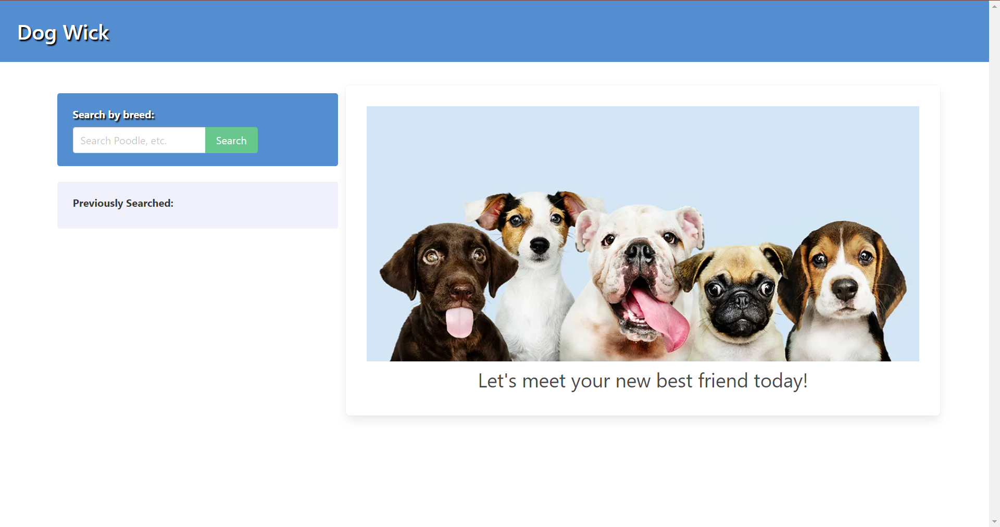

# Find-My-Doggy

## Description 

Have you always wanted a dog but found it hard to pick one?
Do you worry your dog might die shortly after you get it and become attached?
Do you worry that choosing a dog rfandomly could result in chaos in your home?

Well, we've got a solution for you. Here at DogWick, we aim to help our users find just the right dowg for their lifestyle. Life has enough heartbreak, let us tell you how long you can expect your new bestfriend to be around for and exactly what kind of energy they'll be bringing to your life. And while we're at it, we've got a movie suggestion to get you and your best friend cuddling all night.

## Usage

Once on the landing page, user will type any dog breed in the search bar and click search. User will then be displayed an image and information about that dog breed, as well as a random movie for the user and their companion to watch.

## Technology Used

This application was built using HTML, CSS, JavaScript. The team also used Bulma.io as our CSS framework, the DOG API, and OMDB API to retrieve information on dog breeds and movies.

## Deployed Page

Deployed page screenshot: 

Deployed site link:

**https://shcherbatiuk17.github.io/dog-wick/**

## Credits

Credits to: Luis, Marian, Rhema and Francis for working together to create this website.

Thank you to TA Chris for helping guide the team and being a reliable source for questions that the team needed answers to.

Bulma.io provided the framework for this site. 

## License

Please refer to LICENSE in repository! 
